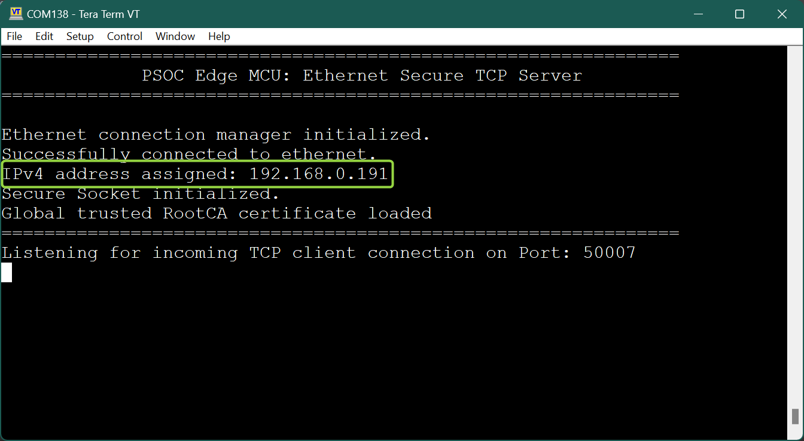
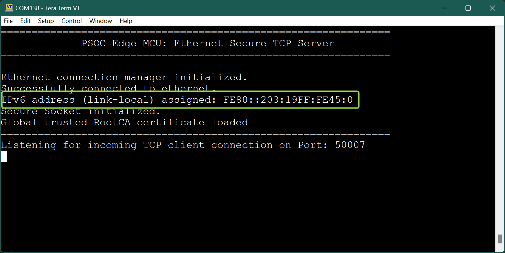
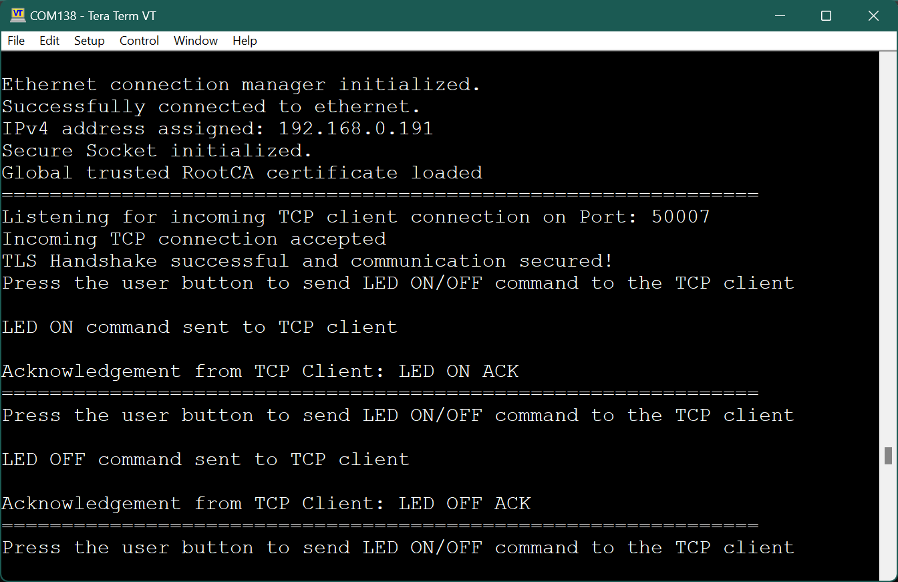
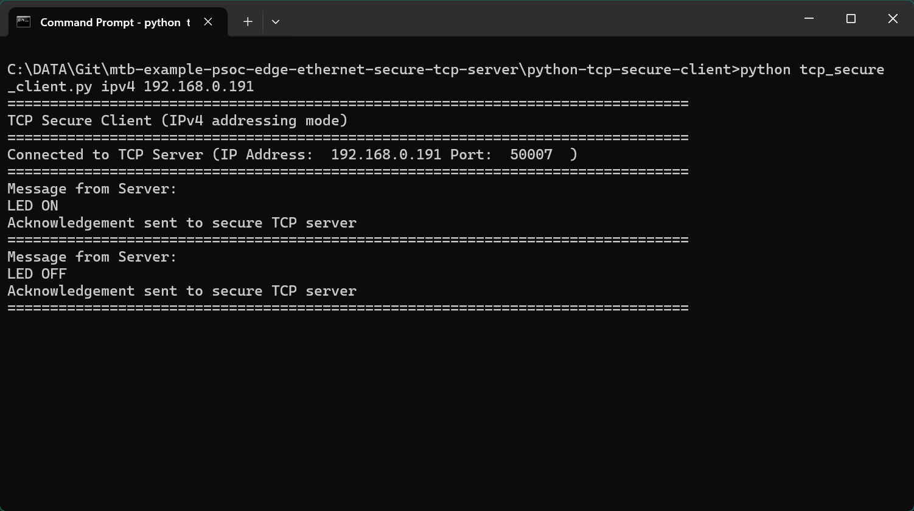
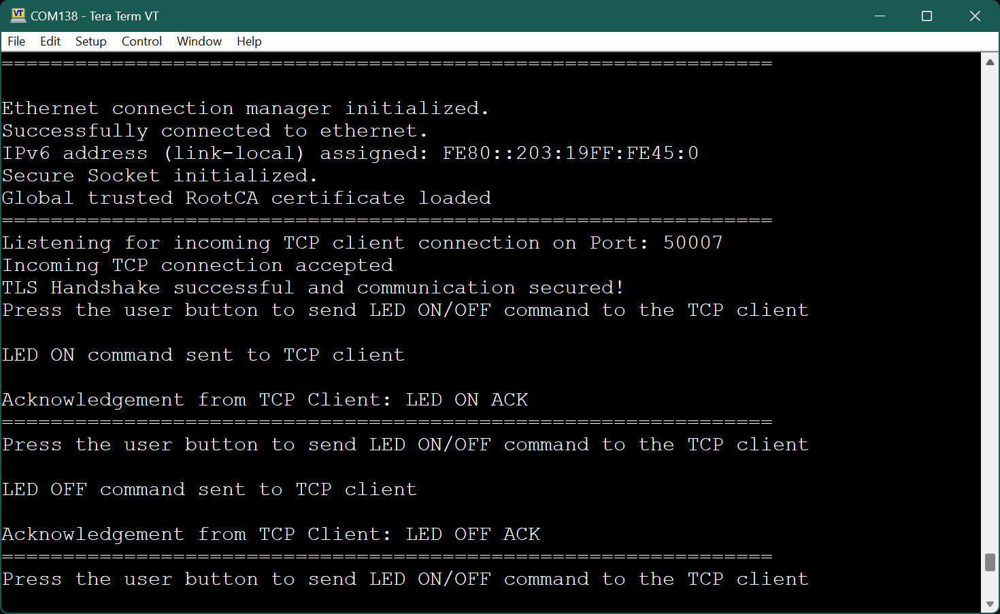
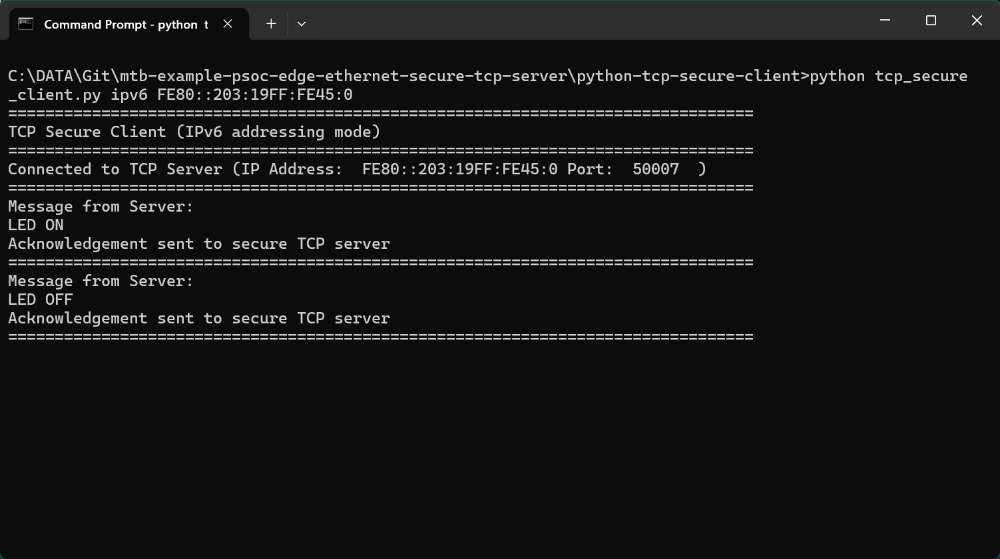

# PSOC&trade; Edge MCU: Ethernet secure TCP server

This code example demonstrates the implementation of a secure TCP server with PSOC&trade; Edge E84 MCU.

In this example, the TCP server establishes a secure connection with a TCP client through an SSL handshake. After the SSL handshake completes successfully, the server allows you to send an LED ON/OFF command to the TCP client; the client responds by sending an acknowledgement message to the server.

This example uses the Ethernet Core FreeRTOS lwIP mbedtls library of the software development kit (SDK). This library enables application development based on Ethernet by bundling together various other libraries: Ethernet Connection Manager, FreeRTOS, lwIP TCP/IP stack, Mbed TLS, and Secure sockets. The Secure sockets library provides an easy-to-use API by abstracting the network stack (lwIP) and the security stack (Mbed TLS).

This code example has a three project structure: CM33 secure, CM33 non-secure, and CM55 projects. All three projects are programmed to the external QSPI flash and executed in Execute in Place (XIP) mode. Extended boot launches the CM33 secure project from a fixed location in the external flash, which then configures the protection settings and launches the CM33 non-secure application. Additionally, CM33 non-secure application enables CM55 CPU and launches the CM55 application.


[View this README on GitHub.](https://github.com/Infineon/mtb-example-psoc-edge-ethernet-secure-tcp-server)

[Provide feedback on this code example.](https://cypress.co1.qualtrics.com/jfe/form/SV_1NTns53sK2yiljn?Q_EED=eyJVbmlxdWUgRG9jIElkIjoiQ0UyNDE5MDIiLCJTcGVjIE51bWJlciI6IjAwMi00MTkwMiIsIkRvYyBUaXRsZSI6IlBTT0MmdHJhZGU7IEVkZ2UgTUNVOiBFdGhlcm5ldCBzZWN1cmUgVENQIHNlcnZlciIsInJpZCI6InNyZHMiLCJEb2MgdmVyc2lvbiI6IjEuMC4wIiwiRG9jIExhbmd1YWdlIjoiRW5nbGlzaCIsIkRvYyBEaXZpc2lvbiI6Ik1DRCIsIkRvYyBCVSI6IklDVyIsIkRvYyBGYW1pbHkiOiJQU09DIn0=)

See the [Design and implementation](docs/design_and_implementation.md) for the functional description of this code example.


## Requirements

- [ModusToolbox&trade;](https://www.infineon.com/modustoolbox) v3.6 or later (tested with v3.6)
- Board support package (BSP) minimum required version: 1.0.0
- Programming language: C
- Associated parts: All [PSOC&trade; Edge E84 MCU](https://www.infineon.com/products/microcontroller/32-bit-psoc-arm-cortex/32-bit-psoc-edge-arm/psoc-edge-e84) parts


## Supported toolchains (make variable 'TOOLCHAIN')

- GNU Arm&reg; Embedded Compiler v14.2.1 (`GCC_ARM`) – Default value of `TOOLCHAIN`
- Arm&reg; Compiler v6.22 (`ARM`)
- IAR C/C++ Compiler v9.50.2 (`IAR`)
- LLVM Embedded Toolchain for Arm&reg; v19.1.5 (`LLVM_ARM`)


## Supported kits (make variable 'TARGET')

- [PSOC&trade; Edge E84 Evaluation Kit](https://www.infineon.com/KIT_PSE84_EVAL) (`KIT_PSE84_EVAL_EPC2`) – Default value of `TARGET`


## Hardware setup

This example requires the board rework. See the "Rework for Ethernet subsystem" section in the kit user guide to configure the board correctly.

Ensure the following jumper and pin configuration on board.
- BOOT SW must be in the HIGH/ON position
- J20 and J21 must be in the tristate/not connected (NC) position

> **Note:** On the PSOC&trade; Edge E84 Evaluation Kit, a few of the Ethernet pins are multiplexed with the Bluetooth&reg; UART pins of the radio module. Therefore, after the board rework, the Bluetooth&reg; functionality cannot be concurrently used with the along with Ethernet.


## Software setup

See the [ModusToolbox&trade; tools package installation guide](https://www.infineon.com/ModusToolboxInstallguide) for information about installing and configuring the tools package.

Install a terminal emulator if you do not have one. Instructions in this document use [Tera Term](https://teratermproject.github.io/index-en.html).

Install the Python interpreter and add it to the top of the system path in environmental variables. This code example is tested with [Python 3.12.4](https://www.python.org/downloads/release/python-3124/).


## Operation

See [Using the code example](docs/using_the_code_example.md) for instructions on creating a project, opening it in various supported IDEs, and performing tasks, such as building, programming, and debugging the application within the respective IDEs.

1. Connect the board to your PC using the provided USB cable through the KitProg3 USB connector

2. Connect one LAN cable from the target board (server) to the router and another LAN cable from your PC (client) to the router

3. Configure the IP addressing mode. By default, IPv4-based addressing is used. To use IPv6 addressing mode, set the `USE_IPV6_ADDRESS` macro defined in the *secure_tcp_server.h* file as follows:

   ```
   #define USE_IPV6_ADDRESS				      (1U)
   ```

4. Open a terminal program and select the KitProg3 COM port. Set the serial port parameters to 8N1 and 115200 baud

5. After programming, the application starts automatically. Confirm that the text as shown in either one of the following figures is displayed on the UART terminal

   *Figure 1* shows the Ethernet connection status using IPv4 address

   **Figure 1. UART terminal showing the Ethernet connection status (IPv4 addressing mode)**

   

   <br>

   *Figure 2* shows the Ethernet connection status using IPv6 address

   **Figure 2. UART terminal showing the Ethernet connection status (IPv6 addressing mode)**

   

   <br>

6. From the project directory (*{project directory}/python-tcp-secure-client* folder), open a command-shell and run the Python TCP secure client (*tcp_secure_client.py*). In the command-shell opened in the project directory, enter the following command based on the IP addressing mode configuration:

   **For IPv4-based addressing**

   ```
   python tcp_secure_client.py ipv4 <IPv4 address of the kit>
   ```

   **For IPv6-based addressing**

   ```
   python tcp_secure_client.py ipv6 <IPv6 address of the kit>
   ```

   > **Note:** Ensure that the firewall settings of your computer allow access to the Python software so that it can communicate with the TCP server. For more details on enabling Python access, see this [community thread](https://community.infineon.com/thread/53662)

7. Once the connection has been established, press the user button (**USER BTN1/SW2**) to send an LED ON/OFF command to the Python TCP client

   Each user button press will issue the LED ON or LED OFF commands alternately. The client in turn sends an acknowledgement message back to the server

   *Figure 3* shows the TCP server output in IPv4 addressing mode

   **Figure 3. TCP server output (IPv4 addressing mode)**

   

   <br>

   *Figure 4* shows the TCP client output using Python script in IPv4 addressing mode

   **Figure 4. TCP client output (IPv4 addressing mode)**

   

   <br>

   *Figure 5* shows the TCP server output in IPv6 addressing mode

   **Figure 5. TCP server output (IPv6 addressing mode)**

   

   <br>

   *Figure 6* shows the TCP client output using Python script in IPv6 addressing mode

   **Figure 6. TCP client output (IPv6 addressing mode)**

   

   <br>

> **Note:** Instead of using the Python TCP client (*tcp_secure_client.py*), alternatively you can use the [mtb-example-psoc-edge-ethernet-secure-tcp-client](https://github.com/Infineon/mtb-example-psoc-edge-ethernet-secure-tcp-client) example to run as the TCP client on the second kit. See the code example documentation to learn how to use the example.


### Creating a self-signed SSL certificate

The TCP server demonstrated in this example uses a self-signed SSL certificate. This requires **OpenSSL**, which is already preloaded in ModusToolbox&trade;. Self-signed SSL certificate means that there is no third-party certificate issuing authority, commonly referred to as "CA", involved in the authentication of the server.

> **Note:** Clients connecting to this server must have an exact copy of the SSL certificate to verify the server's identity.


#### Generate SSL certificate and private key

Follow these steps to generate a self-signed SSL certificate:

1. Run the following command with a CLI (on Windows, use the command-line **modus-shell** program provided in ModusToolbox&trade; instead of a standard Windows command-line application) to generate the CA certificate using the following commands <br> Follow the instructions in the command window to provide the details required

   ```
   openssl ecparam -name prime256v1 -genkey -noout -out root_ca.key
   openssl req -new -x509 -sha256 -key root_ca.key -out root_ca.crt -days 1000
   ```

2. Generate the server key pair and server certificate (signed using the CA certificate from **Step 1**) <br> Follow the instructions in the command window to provide the details required

   ```
   openssl ecparam -name prime256v1 -genkey -noout -out server.key
   openssl req -new -sha256 -key server.key -out server.csr
   openssl x509 -req -in server.csr -CA root_ca.crt -CAkey root_ca.key -CAcreateserial -out server.crt -days 1000 -sha256
   ```

3. Follow the instructions in the command window to provide the details required for creating the SSL certificate and private key

   > **Note:** The *server.crt* file is the server's certificate, and *server.key* is the server's private key

   > **Note:** Ensure to include the hostname in the Python script (*tcp_secure_client.py*) with the common name (CA) that is used during the creation of the server key pair and server certificate using the above-mentioned commands.


## Related resources

Resources  | Links
-----------|----------------------------------
Application notes  | [AN235935](https://www.infineon.com/AN235935) – Getting started with PSOC&trade; Edge E84 MCU on ModusToolbox&trade; software <br> [AN236697](https://www.infineon.com/AN236697) – Getting started with PSOC&trade; MCU and AIROC&trade; Connectivity devices
Code examples  | [Using ModusToolbox&trade;](https://github.com/Infineon/Code-Examples-for-ModusToolbox-Software) on GitHub
Device documentation | [PSOC&trade; Edge E84 MCU datasheet](https://www.infineon.com/products/microcontroller/32-bit-psoc-arm-cortex/32-bit-psoc-edge-arm#documents) <br> [PSOC&trade; Edge E84 MCU reference manuals](https://www.infineon.com/products/microcontroller/32-bit-psoc-arm-cortex/32-bit-psoc-edge-arm#documents)
Development kits | Select your kits from the [Evaluation board finder](https://www.infineon.com/cms/en/design-support/finder-selection-tools/product-finder/evaluation-board)
Libraries  | [mtb-dsl-pse8xxgp](https://github.com/Infineon/mtb-dsl-pse8xxgp) – Device support library for PSE8XXGP <br> [retarget-io](https://github.com/Infineon/retarget-io) – Utility library to retarget STDIO messages to a UART port
Tools  | [ModusToolbox&trade;](https://www.infineon.com/modustoolbox) – ModusToolbox&trade; software is a collection of easy-to-use libraries and tools enabling rapid development with Infineon MCUs for applications ranging from wireless and cloud-connected systems, edge AI/ML, embedded sense and control, to wired USB connectivity using PSOC&trade; Industrial/IoT MCUs, AIROC&trade; Wi-Fi and Bluetooth&reg; connectivity devices, XMC&trade; Industrial MCUs, and EZ-USB&trade;/EZ-PD&trade; wired connectivity controllers. ModusToolbox&trade; incorporates a comprehensive set of BSPs, HAL, libraries, configuration tools, and provides support for industry-standard IDEs to fast-track your embedded application development

<br>


## Other resources

Infineon provides a wealth of data at [www.infineon.com](https://www.infineon.com) to help you select the right device, and quickly and effectively integrate it into your design.


## Document history

Document title: *CE241902* – *PSOC&trade; Edge MCU: Ethernet secure TCP server*

 Version | Description of change
 ------- | ---------------------
 1.0.0   | New code example
 <br>


All referenced product or service names and trademarks are the property of their respective owners.

The Bluetooth&reg; word mark and logos are registered trademarks owned by Bluetooth SIG, Inc., and any use of such marks by Infineon is under license.

PSOC&trade;, formerly known as PSoC&trade;, is a trademark of Infineon Technologies. Any references to PSoC&trade; in this document or others shall be deemed to refer to PSOC&trade;.

---------------------------------------------------------

© Cypress Semiconductor Corporation, 2025. This document is the property of Cypress Semiconductor Corporation, an Infineon Technologies company, and its affiliates ("Cypress").  This document, including any software or firmware included or referenced in this document ("Software"), is owned by Cypress under the intellectual property laws and treaties of the United States and other countries worldwide.  Cypress reserves all rights under such laws and treaties and does not, except as specifically stated in this paragraph, grant any license under its patents, copyrights, trademarks, or other intellectual property rights.  If the Software is not accompanied by a license agreement and you do not otherwise have a written agreement with Cypress governing the use of the Software, then Cypress hereby grants you a personal, non-exclusive, nontransferable license (without the right to sublicense) (1) under its copyright rights in the Software (a) for Software provided in source code form, to modify and reproduce the Software solely for use with Cypress hardware products, only internally within your organization, and (b) to distribute the Software in binary code form externally to end users (either directly or indirectly through resellers and distributors), solely for use on Cypress hardware product units, and (2) under those claims of Cypress's patents that are infringed by the Software (as provided by Cypress, unmodified) to make, use, distribute, and import the Software solely for use with Cypress hardware products.  Any other use, reproduction, modification, translation, or compilation of the Software is prohibited.
<br>
TO THE EXTENT PERMITTED BY APPLICABLE LAW, CYPRESS MAKES NO WARRANTY OF ANY KIND, EXPRESS OR IMPLIED, WITH REGARD TO THIS DOCUMENT OR ANY SOFTWARE OR ACCOMPANYING HARDWARE, INCLUDING, BUT NOT LIMITED TO, THE IMPLIED WARRANTIES OF MERCHANTABILITY AND FITNESS FOR A PARTICULAR PURPOSE.  No computing device can be absolutely secure.  Therefore, despite security measures implemented in Cypress hardware or software products, Cypress shall have no liability arising out of any security breach, such as unauthorized access to or use of a Cypress product. CYPRESS DOES NOT REPRESENT, WARRANT, OR GUARANTEE THAT CYPRESS PRODUCTS, OR SYSTEMS CREATED USING CYPRESS PRODUCTS, WILL BE FREE FROM CORRUPTION, ATTACK, VIRUSES, INTERFERENCE, HACKING, DATA LOSS OR THEFT, OR OTHER SECURITY INTRUSION (collectively, "Security Breach").  Cypress disclaims any liability relating to any Security Breach, and you shall and hereby do release Cypress from any claim, damage, or other liability arising from any Security Breach.  In addition, the products described in these materials may contain design defects or errors known as errata which may cause the product to deviate from published specifications. To the extent permitted by applicable law, Cypress reserves the right to make changes to this document without further notice. Cypress does not assume any liability arising out of the application or use of any product or circuit described in this document. Any information provided in this document, including any sample design information or programming code, is provided only for reference purposes.  It is the responsibility of the user of this document to properly design, program, and test the functionality and safety of any application made of this information and any resulting product.  "High-Risk Device" means any device or system whose failure could cause personal injury, death, or property damage.  Examples of High-Risk Devices are weapons, nuclear installations, surgical implants, and other medical devices.  "Critical Component" means any component of a High-Risk Device whose failure to perform can be reasonably expected to cause, directly or indirectly, the failure of the High-Risk Device, or to affect its safety or effectiveness.  Cypress is not liable, in whole or in part, and you shall and hereby do release Cypress from any claim, damage, or other liability arising from any use of a Cypress product as a Critical Component in a High-Risk Device. You shall indemnify and hold Cypress, including its affiliates, and its directors, officers, employees, agents, distributors, and assigns harmless from and against all claims, costs, damages, and expenses, arising out of any claim, including claims for product liability, personal injury or death, or property damage arising from any use of a Cypress product as a Critical Component in a High-Risk Device. Cypress products are not intended or authorized for use as a Critical Component in any High-Risk Device except to the limited extent that (i) Cypress's published data sheet for the product explicitly states Cypress has qualified the product for use in a specific High-Risk Device, or (ii) Cypress has given you advance written authorization to use the product as a Critical Component in the specific High-Risk Device and you have signed a separate indemnification agreement.
<br>
Cypress, the Cypress logo, and combinations thereof, ModusToolbox, PSoC, CAPSENSE, EZ-USB, F-RAM, and TRAVEO are trademarks or registered trademarks of Cypress or a subsidiary of Cypress in the United States or in other countries. For a more complete list of Cypress trademarks, visit www.infineon.com. Other names and brands may be claimed as property of their respective owners.